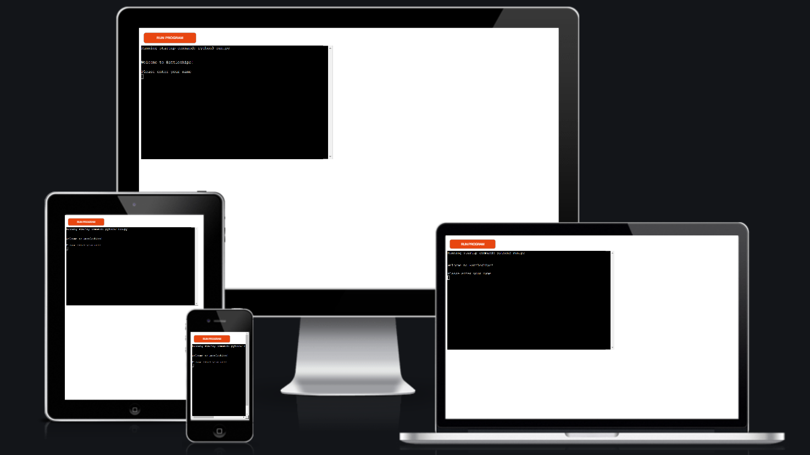
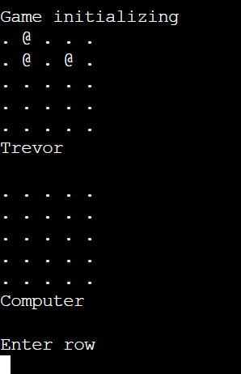
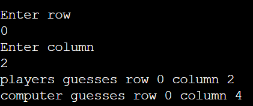
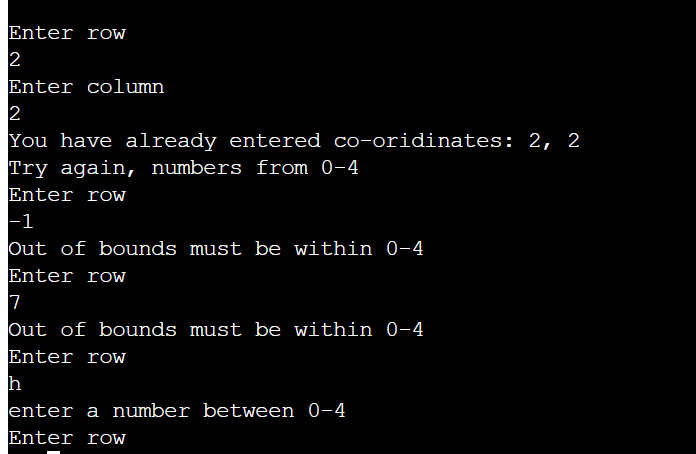

<h1 align="left">Battleships</h1>

[View the live project here.](https://battle-ships-p3.herokuapp.com/)

<h2 align ="center"></h2>

## How to play

 This game is based on the classic battleship game.

 The program generates two random boards, one for the player and one for
  computer.

 Both boards then also have the location of there ships randomly generated
 with the computers ships not being revealed to the player

 The player then inputs co-ordinates to guess the location of the computer's ship and the 
 computer guesses through a randomly generated number.

 If either player hits, the board will be updated with a * in the location the guess was made.
 If either player missess, the board will be updated with a X in the location the guess was made.

 when a player hits all the ships the player wins!!!

    
## Features

- ### Existing Features

 

 

- Random board generation

- Play vs the computer.
- Input guesses from user.

- Validates users input .
- If input is anything other than requred the user is reminded with a print message.

### Future Features

-  Ship placement by user
-  Board size selection
-  Static board
-  Larger ships

### Languages Used

-   [PYTHON](https://en.wikipedia.org/wiki/Python_(programming_language))

### Frameworks, Libraries & Programs Used
    

1. [Git:](https://git-scm.com/)
    - Git was used for version control by utilizing the Gitpod terminal to commit to Git and Push to GitHub.
1. [GitHub:](https://github.com/)
    - GitHub is used to store the projects code after being pushed from Git.

    

## Testing
### Code Validation

The PEP8  Service was used to validate the project.

-   [PYTHON Validator](http://pep8online.com/) - [Results](images/pep8.png)
     
     

## Deployment

This project was deployed using Code Institute's mock terminal for Heroku:

   1. Fork or clone this repository

   2. Create a new Heroku app
   
   3. Set the buildbacks to Python and NodeJS in that order

   4. Link the Heroku app to the repository

   5. click on Deploy

   

## Credits

### Code

-  Code institute project scope video code was used as framework for the code I built

-  Code institute project scope read me

### Acknowledgements

-   The tutoring team and Python Tutor!